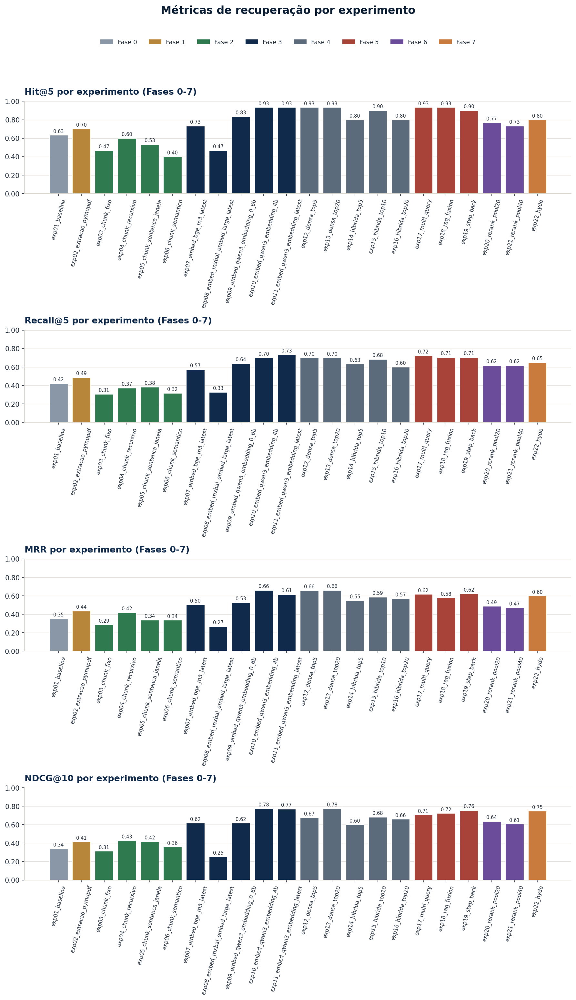
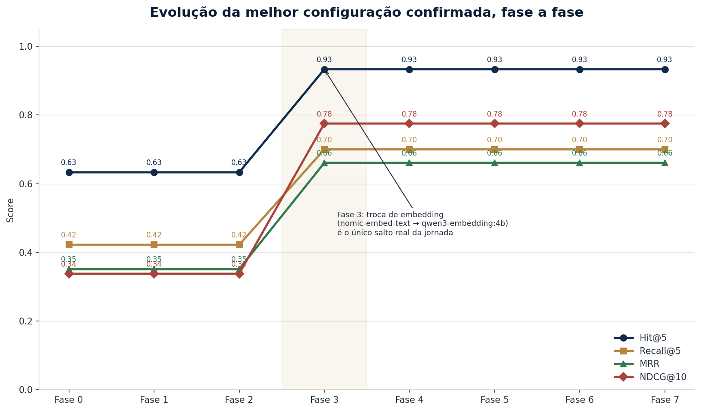
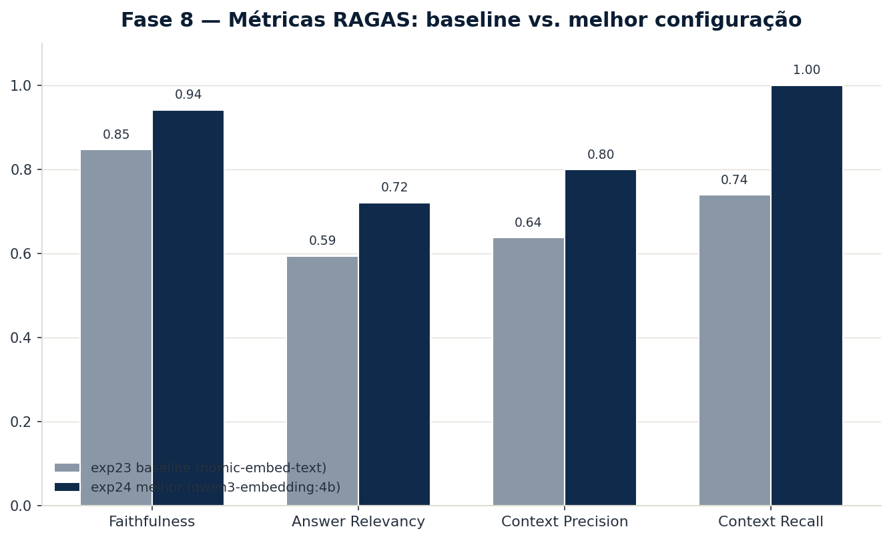

# A Jornada de Melhoria da Recuperação em RAG — Cadeia de Custódia da Prova Pericial

**Disciplina:** RAG & CAG Aplicados a Direito e Segurança Pública (MBA IBMEC)
**Grupo:** 7
**Integrantes:** Everaldo Diniz, Gustavo Aranha, Thiago Marques, Guilherme Rabelo, Marcos Soares, Modestino André
**Ponto de partida:** aplicação do Projeto Final (`aula12/projeto_final/`), copiada para `ProjetoF/`

> Rascunho em construção — preenchido fase a fase, conforme os experimentos são medidos. Seções marcadas como `[PENDENTE]` ainda não têm dados.

---

## 1. A fonte de dados e por quê

Fonte escolhida: **"Cadeia de Custódia da Prova Pericial: uma análise da Lei 13.964/2019"**
(GIACOMOLLI; AMARAL, 2020) — artigo acadêmico em PDF nativo (com camada de texto,
não escaneado), tratando da cadeia de custódia de vestígios/provas periciais no
processo penal brasileiro, a partir da Lei 13.964/2019 (Pacote Anticrime).

Escolhido, em primeiro lugar, porque o **Grupo 7 é formado por Peritos Criminais**, para
quem a cadeia de custódia da prova pericial é um tema central da rotina profissional
(rastreio e integridade de vestígios do local de crime até o laudo) — um caso de uso
real de RAG sobre esse tema seria apoiar peritos e operadores do direito a consultar
rapidamente a legislação e a doutrina sobre cadeia de custódia. Também é diretamente
relacionado ao tema da disciplina (Direito e Segurança Pública) e tem estrutura mista —
texto corrido, seções tituladas, referência a artigos de lei e a jurisprudência (Corte
Interamericana de Direitos Humanos) — o que permite testar diferentes técnicas de
chunking e recuperação ao longo da jornada. Essa origem profissional também orienta o
tipo de pergunta incluído no gabarito (Seção 2): dúvidas práticas de procedimento
(lacre, embalagem, central de custódia), não só teóricas.

## 2. O dataset de avaliação (gabarito)

`avaliacao/dataset.json` — construído manualmente sobre o artigo:

- **18 documentos (D01–D18)**: segmentos temáticos do artigo, distribuídos ao longo
  de todo o texto (não são os chunks reais gerados pela ingestão — servem de unidade
  de gabarito).
- **30 perguntas (`queries_benchmark`)**, em 3 tipos (Seção 5 do `Roteiro_Final.md`):
  - **factual** (Q01–Q12): resposta está em 1 segmento.
  - **reformulável** (Q13–Q22): mesmo conteúdo, mas em linguagem coloquial/leiga —
    testa o ganho de multi-query / step-back.
  - **multihop** (Q23–Q30): resposta exige combinar 2–3 segmentos — testa o ganho de
    RAG-Fusion / grafo.
- Perguntas escritas em linguagem natural, evitando copiar termos exatos do texto
  (para não inflar artificialmente a baseline — lição da Seção 5 do roteiro).
- `relevancia`: nota 2 (muito relevante) / 1 (relevante) por documento, para NDCG
  graduado.

**Como a recuperação é avaliada sem `id_original` estável:** o pipeline do projeto
não grava um id de chunk rastreável até o documento de origem. A avaliação identifica
cada chunk recuperado **pelo conteúdo**, procurando "marcadores" (trechos distintivos)
de cada D0x no texto do chunk (ver `avaliacao/README.md` para o detalhe). É uma
aproximação documentada, revisável via `avaliacao/detalhe_<exp>.json`.

## 3. Metodologia

- **Métricas de recuperação:** Hit@5, Recall@5, MRR, NDCG@10 (`avaliacao/avaliar_recuperacao.py`).
- **Métricas de geração (RAGAS):** Faithfulness, Answer Relevancy, Context Precision/Recall
  (`avaliacao/rodar_fase8_ragas.py`) — rodadas ao final (Fase 8) na baseline (`exp23`) e na
  melhor configuração (`exp24`); ver Seção 5, Fase 8.
- **top_k:** 10 chunks recuperados por consulta (cobre Hit@5/Recall@5 e NDCG@10 na
  mesma rodada).
- **Experimento controlado:** uma variável por vez. Cada fase reindexa o OpenSearch
  fixando tudo o que não está sendo testado (mesmo embedding, mesma técnica de busca,
  mesmo top_k) e o script de cada fase restaura o índice para o estado da baseline
  ao final, para a próxima fase não herdar configuração errada.
- **Registro:** uma linha por experimento em `avaliacao/resultados.csv` (`exp`, `fase`,
  `mudança`, métricas, observação) + `avaliacao/detalhe_<exp>.json` com os chunks
  recuperados por pergunta (auditoria).
- **Infra:** OpenSearch local (Docker), embeddings via Ollama (`nomic-embed-text`, 768d,
  baseline), geração via LLM agnóstico a provedor (`app/config.py::config_llm()`) — Groq
  (`llama-3.3-70b-versatile`) nas Fases 0-7; trocado para OpenRouter
  (`meta-llama/llama-3.3-70b-instruct`, mesmo modelo Llama 3.3 70B) na Fase 8 por causa do
  limite diário de tokens do tier gratuito da Groq (nota técnica na Seção 5, Fase 8).

## 4. Baseline (Fase 0)

Projeto rodado como veio: ingestão do PDF forçando `estrategia=opensearch` (a
heurística automática do projeto rotearia para o grafo/LightRAG por causa da
densidade de entidades nomeadas do texto — decisão documentada, ver Seção 8.2),
chunking `auto` (a heurística escolheu `hierárquico`, por o texto ter ≥3 títulos),
embedding `nomic-embed-text`, busca `baseline` (sem reescrita de query), `top_k=10`.
143 chunks indexados.

| Métrica | Valor |
|---|---|
| Hit@5 | 0,633 |
| Recall@5 | 0,422 |
| MRR | 0,351 |
| NDCG@10 | 0,338 |
| Latência média | 2,72 s |

Ponto de partida: cobre a maioria das perguntas no top-5 (Hit@5 alto), mas o relevante
raramente vem em 1º lugar (MRR baixo) e o ranking fino ainda é fraco (NDCG@10 baixo) —
espaço claro de melhoria nas próximas fases.

## 5. Experimentos por fase

### Fase 1 — Extração (`exp02_extracao_pymupdf`)

**Hipótese:** texto mal extraído limita tudo a jusante (Docling, com sua camada de
markdown/estrutura, deveria extrair melhor que um fallback de texto puro).

**Mudança:** reextração do mesmo PDF via PyMuPDF (texto puro, sem markdown/OCR),
mantendo o chunking **fixo** em `hierárquico` (igual ao baseline) para isolar a
extração como única variável (`avaliacao/rodar_fase1_extracao.py`).

**Resultado:**

| Métrica | exp01 (Docling) | exp02 (PyMuPDF) | Δ |
|---|---|---|---|
| Hit@5 | 0,633 | 0,700 | +0,067 |
| Recall@5 | 0,422 | 0,489 | +0,067 |
| MRR | 0,351 | 0,436 | +0,085 |
| NDCG@10 | 0,338 | 0,415 | +0,077 |
| Chunks gerados | 143 | 134 | — |

**Análise:** resultado contraintuitivo — o extrator "mais simples" (PyMuPDF) venceu
o Docling em **todas** as métricas de recuperação. Hipótese para o motivo: a marcação
markdown do Docling (`#`, `##`, `|` de tabela) introduz tokens que não aparecem nas
perguntas em linguagem natural dos usuários, diluindo a similaridade semântica dos
embeddings; além disso, como o `HierarchicalDocumentSplitter` conta palavras para
decidir os limites de chunk, os símbolos de markdown deslocam esses limites — daí os
143 chunks do Docling vs 134 do PyMuPDF para o mesmo texto-fonte. Amostras salvas em
`avaliacao/amostras_extracao/{docling,pymupdf}.txt` para inspeção manual.

Achado relevante para o relatório final: o Docling costuma ganhar em documentos
complexos (múltiplas colunas, tabelas, PDFs escaneados) — aqui, num PDF acadêmico de
coluna única e bem formatado, a extração "burra" saiu na frente. Vale frisar isso
como *trade-off*, não como regra geral.

*(As próximas fases usam o índice restaurado ao estado do Docling/baseline — o ganho
do PyMuPDF nesta fase ainda não foi "adotado" como configuração corrente; decisão
sobre qual extração vira a base das fases seguintes fica para a Seção 7 deste
relatório, ao consolidar tudo.)*

### Fase 2 — Chunking (`exp03`–`exp06`)

**Hipótese:** a granularidade do chunk muda o que é recuperável.

**Mudança:** com a extração fixa em Docling (a mesma do baseline/exp01), testadas as
outras 4 técnicas de chunking do projeto — `fixo`, `recursivo`, `sentença_janela`,
`semântico` — cada uma reindexando do zero (`avaliacao/rodar_fase2_chunking.py`).
`hierárquico` não foi reindexado de novo: é exatamente a configuração do exp01.

**Resultado:**

| Técnica | Hit@5 | Recall@5 | MRR | NDCG@10 | Chunks |
|---|---|---|---|---|---|
| hierárquico (exp01) | 0,633 | 0,422 | 0,351 | 0,338 | 143 |
| fixo (exp03) | 0,467 | 0,306 | 0,287 | 0,312 | 72 |
| recursivo (exp04) | 0,600 | 0,372 | **0,418** | **0,426** | 81 |
| sentença_janela (exp05) | 0,533 | 0,383 | 0,338 | 0,416 | 240 |
| semântico (exp06) | 0,400 | 0,317 | 0,336 | 0,358 | 96 |

**Análise:** nenhuma técnica domina em tudo — há um trade-off entre *cobertura* e
*qualidade do ranking*. `hierárquico` continua sendo o melhor em Hit@5/Recall@5 (traz
o relevante no top-5 com mais frequência), mas `recursivo` tem o melhor MRR e NDCG@10
(quando acerta, acerta mais perto do topo do ranking) — apesar de gerar só 81 chunks
(bem menos que os 143 do hierárquico), sugerindo que blocos de ~200 palavras
respeitando frase/parágrafo capturam o suficiente de contexto sem diluir a
similaridade com blocos grandes demais. `fixo` (chunks cegos de 200 palavras, sem
respeitar limites de frase) e `semântico` (corte por mudança de tópico, 96 chunks)
saíram piores em todas as métricas — no caso do `semântico`, possivelmente porque o
artigo é curto e coeso o bastante para o corte por tópico não trazer benefício real,
só reduzir a granularidade. `sentença_janela` gerou muito mais chunks (240, blocos de
3 sentenças) e teve o 2º melhor NDCG@10, mas ficou atrás em Hit@5/Recall@5.

Como o roteiro pede otimizar recuperação (cobertura) antes de geração, e Hit@5/Recall@5
são as métricas de cobertura, `hierárquico` segue como chunking de referência para as
próximas fases — mas `recursivo` fica marcado como candidato forte a reavaliar quando
somarmos reranking (Fase 6), já que reranking tende a amplificar o benefício de um MRR
melhor.

*(Índice restaurado para `hierárquico` ao final da fase, para a Fase 3 partir do
mesmo estado do baseline.)*

### Fase 3 — Modelo de embedding (`exp07`–`exp11`)

**Hipótese:** o modelo de embedding define o teto da busca densa.

**Mudança:** com extração (Docling) e chunking (`hierárquico`) fixos, testados todos
os modelos de embedding baixados no Ollama local além do baseline
(`nomic-embed-text`): `bge-m3`, `mxbai-embed-large` e as 3 variantes de tamanho do
`qwen3-embedding` (0.6b/4b/8b). Dimensão de cada modelo medida em runtime — os Qwen3
não estavam mapeados em `app/config.py::DIMENSAO_EMBEDDING`
(`avaliacao/rodar_fase3_embedding.py`).

**Resultado:**

| Modelo | Dim. | Hit@5 | Recall@5 | MRR | NDCG@10 |
|---|---|---|---|---|---|
| nomic-embed-text (exp01, baseline) | 768 | 0,633 | 0,422 | 0,351 | 0,338 |
| bge-m3 (exp07) | 1024 | 0,733 | 0,572 | 0,505 | 0,618 |
| mxbai-embed-large (exp08) | 1024 | 0,467 | 0,328 | 0,269 | 0,253 |
| qwen3-embedding:0.6b (exp09) | 1024 | 0,833 | 0,639 | 0,527 | 0,618 |
| qwen3-embedding:4b (exp10) | 2560 | **0,933** | 0,700 | **0,661** | 0,775 |
| qwen3-embedding:8b "latest" (exp11) | 4096 | **0,933** | **0,733** | 0,615 | **0,775** |

**Análise:** de longe a fase com maior ganho da jornada até aqui. A família
Qwen3-Embedding varre o baseline em todas as métricas, mesmo na menor variante
(0.6b): Hit@5 salta de 0,633 para 0,833–0,933, e o MRR praticamente dobra. Dentro da
família Qwen3, o ganho de 0.6b → 4b é grande (MRR 0,527 → 0,661), mas de 4b → 8b o
ganho é marginal e misto (8b vence em Recall@5, mas *perde* em MRR para o 4b) — mais
que dobrar a dimensão (2560 → 4096) e o tamanho do modelo não se traduziu em ganho
proporcional. Custo-benefício: **qwen3-embedding:4b** parece o melhor equilíbrio
(dimensão bem menor que o 8b, latência parecida, métricas equivalentes ou melhores).

`bge-m3` também superou o baseline com folga (2º melhor colocado no geral) — resultado
esperado, é um modelo multilíngue forte e mais recente que o `nomic-embed-text`.
`mxbai-embed-large`, por outro lado, ficou **abaixo do baseline** em todas as
métricas — resultado negativo relevante: nem todo modelo "maior"/mais recente
supera o `nomic-embed-text` neste corpus; dimensão (1024) não é garantia de
qualidade — vale registrar como contraexemplo no relatório final.

`qwen3-embedding:4b` é o forte candidato a entrar na configuração final (Seção 7);
a decisão de **quando** passar a usá-lo como base fixa das próximas fases (em vez de
seguir isolando tudo contra o `nomic-embed-text` do exp01) está registrada em
"8.1 Decisões técnicas relevantes já tomadas".

*(Nota técnica: `qwen3-embedding:0.6b` falhou na primeira tentativa por um erro de
conexão com o Ollama local — resolvido rodando o script de novo, que é resumível e
tentou de novo só esse modelo.)*

### Fase 4 — Recuperação base (top_k e busca híbrida) (`exp12`–`exp16`)

**Hipótese:** combinar busca lexical (BM25) com a densa deveria aumentar a cobertura
(vestígios de termos exatos da lei que a busca puramente semântica pode não priorizar);
variar `top_k` também deveria afetar o ranking fino medido pelo NDCG@10.

**Mudança:** a partir desta fase, a base fixa passa a ser Docling + `hierárquico` +
`qwen3-embedding:4b` (jornada progressiva, ver Seção 8.1). Testada a nova técnica
`hibrida` (BM25 + densa via RRF, `OpenSearchHybridRetriever` — novidade em
`app/busca_avancada.py`) contra a busca densa pura, em `top_k` 5/10/20
(`avaliacao/rodar_fase4_hibrida_topk.py`). `densa/top_k=10` não foi remedido: é
exatamente o `exp10` da Fase 3, já na mesma base.

**Resultado:**

| Combinação | Hit@5 | Recall@5 | MRR | NDCG@10 |
|---|---|---|---|---|
| densa top_k=5 (exp12) | 0,933 | 0,700 | 0,657 | 0,674 |
| densa top_k=10 (exp10, referência) | 0,933 | 0,700 | 0,661 | 0,775 |
| densa top_k=20 (exp13) | 0,933 | 0,700 | 0,661 | 0,775 |
| híbrida top_k=5 (exp14) | 0,800 | 0,633 | 0,548 | 0,599 |
| híbrida top_k=10 (exp15) | 0,900 | 0,683 | 0,587 | 0,682 |
| híbrida top_k=20 (exp16) | 0,800 | 0,600 | 0,569 | 0,660 |

**Análise:** resultado contraintuitivo de novo — a busca híbrida (BM25+densa via RRF)
ficou **abaixo** da busca densa pura em todas as métricas, em qualquer `top_k` testado.
A hipótese mais provável: com `qwen3-embedding:4b` a busca densa já está muito forte
neste corpus (Hit@5=0,933), então o BM25 tem pouco a contribuir de complementar — ao
contrário, ele traz para o ranking fundido chunks lexicamente parecidos mas
semanticamente menos relevantes (termos jurídicos repetidos em várias seções do
artigo), e o RRF acaba empurrando para baixo alguns acertos fortes da busca densa.
Dentro da própria família híbrida, `top_k=10` (exp15) foi consistentemente o melhor
dos três, sugerindo que `top_k` muito baixo (5) corta cedo demais um ranking já mais
ruidoso, e `top_k` muito alto (20) dilui ainda mais com chunks de cauda longa do BM25 —
mas mesmo o melhor ponto da híbrida não alcançou a densa pura.

Sobre `top_k` isolado (mantendo densa): `top_k=5` já mantém Hit@5/Recall@5 idênticos a
`top_k=10/20` (o relevante já está garantido nas top-5 posições, se está), mas o
NDCG@10 despenca (0,674 vs 0,775) — efeito mecânico, não de qualidade de busca: com
`top_k=5` só existem 5 documentos para calcular um NDCG que olha até a posição 10, o
que já penaliza o score independente da real relevância. `top_k=10` e `top_k=20` deram
resultado idêntico em todas as métricas — ampliar a janela além de 10 não trouxe nem
tirou nada do ranking dentro das primeiras 10 posições, ou seja, não há chunk relevante
"escondido" entre as posições 11-20 nesta base. Conclusão prática: `top_k=10` segue
sendo o ponto de equilíbrio (não perde nada de `top_k=20` e evita o corte artificial de
`top_k=5`), e a busca densa pura segue como configuração de recuperação de referência
até aqui — a híbrida fica descartada nesta base, mas registrada como resultado negativo
relevante para a análise crítica (Seção 8).

*(Nota técnica: a primeira tentativa desta fase teve o OpenSearch caindo por ~8s no
meio da rodada do `exp15_hibrida_top10` — 23 das 30 perguntas falharam por erro de
conexão. A linha malformada (`n_queries=7`) foi removida do `resultados.csv` e o
script foi rodado de novo — resumível, então só refez o `exp15`; os demais
experimentos (que já tinham completado 30/30) foram pulados.)*

*(Índice **não** foi restaurado ao final desta fase — fica na base
Docling+hierárquico+qwen3-embedding:4b para a Fase 5 em diante, por causa da mudança
de metodologia isolada→progressiva, ver Seção 8.1.)*

### Fase 5 — Query enhancement (`exp17`–`exp19`)

**Hipótese:** reescrever a pergunta original (gerar variações ou uma versão mais
genérica) deveria ajudar a recuperar trechos que a formulação original, sozinha, não
acha — sobretudo nas perguntas `reformulável` (linguagem coloquial) e `multihop`
(Seção 2).

**Mudança:** testadas as 3 técnicas de query enhancement já implementadas em
`app/busca_avancada.py` — `multi_query` (LLM gera variações, funde por dedup),
`rag_fusion` (mesma ideia, funde por RRF) e `step_back` (LLM gera uma pergunta mais
geral, busca [específica + geral]) — contra a busca densa pura (`exp10`), todas em
`top_k=10` (ponto de equilíbrio confirmado na Fase 4). Nenhuma reindexação: a base
segue Docling + `hierárquico` + `qwen3-embedding:4b`, herdada da Fase 4
(`avaliacao/rodar_fase5_query_enhancement.py`).

**Resultado:**

| Combinação | Hit@5 | Recall@5 | MRR | NDCG@10 |
|---|---|---|---|---|
| densa top_k=10 (exp10, referência) | 0,933 | 0,700 | 0,661 | 0,775 |
| multi_query (exp17) | 0,933 | 0,722 | 0,616 | 0,705 |
| rag_fusion (exp18) | 0,933 | 0,706 | 0,579 | 0,723 |
| step_back (exp19) | 0,900 | 0,706 | 0,624 | 0,756 |

**Análise:** o padrão da Fase 4 se repete nas 3 técnicas — todas ficaram **abaixo**
da busca densa pura no MRR, e 2 das 3 (`multi_query`, `rag_fusion`) também ficaram
abaixo no NDCG@10, com ganho só marginal em Recall@5 (entre +0,006 e +0,022).
Hipótese: com a busca densa já tão forte (`qwen3-embedding:4b`), somar consultas
extras (variações do `multi_query`/`rag_fusion`, a pergunta genérica do `step_back`)
traz para o ranking documentos mais diversos mas em média menos precisos, diluindo a
posição dos acertos certeiros da consulta original — o mesmo mecanismo observado na
busca híbrida (Fase 4). Confirma-se também a leitura de que "mais consultas fundidas
dilui mais o ranking": `step_back` (2 consultas, dedup) teve o melhor MRR e NDCG@10
das 3 técnicas; `multi_query` (5 consultas, dedup) teve o melhor Recall@5 mas o pior
NDCG@10; `rag_fusion` (5 consultas, RRF) ficou no meio em Recall@5/NDCG@10 mas teve o
pior MRR de todos — a fusão por RRF, apesar de teoricamente mais robusta que dedup,
não superou o dedup simples neste corpus pequeno e coeso.

Conclusão da fase: nenhuma das 3 técnicas de query enhancement superou a busca densa
pura de referência no ranking fino (MRR/NDCG@10) — mesmo padrão da Fase 4 (busca
híbrida também perdeu para a densa pura). A busca densa pura com `qwen3-embedding:4b`
segue como configuração de recuperação de referência até aqui.

*(Nota técnica: `multi_query` (`exp17`) falhou duas vezes antes de completar 30/30 —
1ª tentativa esgotou a cota diária de tokens do Groq (TPD) no meio da rodada (11/30
antes de travar); numa 2ª tentativa, já com uma chave de API nova, só 2/30 perguntas
passaram (latência média de 30s sugeria timeout/retentativas). Ambas as linhas
malformadas foram descartadas do `resultados.csv` antes da rodada final, que
completou 30/30 sem falhas — a causa exata das 2 tentativas anteriores não foi
diagnosticada a fundo, mas não se repetiu na rodada final.)*

### Fase 6 — Reranking (`exp20`–`exp21`)

**Hipótese:** reordenar os top-N candidatos com um cross-encoder (que vê pergunta e
chunk juntos, ao contrário do bi-encoder da busca densa) deveria subir o relevante
para posições mais altas do ranking — o MRR e o NDCG@10 são as métricas que mais
devem se beneficiar.

**Mudança:** nova técnica `rerank` em `app/busca_avancada.py`/`avaliar_recuperacao.py`
— a busca densa recupera um pool maior de candidatos (`top_k_inicial`), um
cross-encoder (`TransformersSimilarityRanker`, modelo `BAAI/bge-reranker-v2-m3`,
Aula 3) reordena esse pool e corta no `top_k=10` final — testada contra a busca densa
pura (`exp10`, mesma base), em 2 tamanhos de pool (20 e 40), para medir sensibilidade
ao tamanho do pool antes do corte. O Roteiro sugere "recupere top-20 → reranqueie →
top-5"; aqui o corte final ficou em `top_k=10` (em vez de 5) para manter
comparabilidade direta com a referência `exp10` e com as Fases 4/5 (todas medidas em
`top_k=10`). Nenhuma reindexação: mesma base da Fase 4/5
(`avaliacao/rodar_fase6_reranking.py`).

**Resultado:**

| Combinação | Hit@5 | Recall@5 | MRR | NDCG@10 |
|---|---|---|---|---|
| densa top_k=10 (exp10, referência) | 0,933 | 0,700 | 0,661 | 0,775 |
| rerank pool=20 (exp20) | 0,767 | 0,617 | 0,487 | 0,637 |
| rerank pool=40 (exp21) | 0,733 | 0,617 | 0,473 | 0,607 |

**Análise:** o resultado negativo mais forte da jornada até aqui. Diferente da busca
híbrida (Fase 4) e do query enhancement (Fase 5), que perdiam só no MRR/NDCG@10 mas
mantinham Hit@5/Recall@5 praticamente intactos, o reranking piorou em **todas** as
métricas, inclusive cobertura (Hit@5 caiu de 0,933 para 0,767/0,733). Isso é
significativo: os candidatos relevantes já estavam no pool recuperado pela busca
densa (senão o `exp10` não teria Hit@5=0,933) — então o cross-encoder está ativamente
empurrando chunks relevantes pra fora do top-10 final, substituindo-os por candidatos
que ele julga mais parecidos com a pergunta mas que não são, de fato, relevantes pelo
gabarito. Hipótese principal: descasamento de domínio/idioma — o
`BAAI/bge-reranker-v2-m3` é multilíngue mas treinado majoritariamente em dados
gerais de ranking de passagens (tipo mMARCO), não em texto jurídico-pericial em
português; combinado com a marcação markdown do Docling nos chunks (mesma hipótese
usada para explicar o resultado da Fase 1, onde o markdown também prejudicou a
similaridade do embedder), o cross-encoder pode estar julgando mal a relevância
desse vocabulário específico.

Confirma-se de novo o padrão desta jornada (visto na híbrida da Fase 4 e no
rag_fusion/multi_query da Fase 5): pool **maior** piora, não melhora — `pool=40`
(exp21) ficou pior que `pool=20` (exp20) em quase todas as métricas (só empatou em
Recall@5). Mais candidatos dão ao reranker mais chances de errar.

Conclusão da fase: o cross-encoder não ajudou neste corpus — a busca densa pura com
`qwen3-embedding:4b` segue, de longe, a melhor configuração de recuperação medida
até agora em todas as fases.

*(Nota técnica: esta rodada foi executada na CPU do laptop — o torch instalado por
padrão via `requirements.txt` não tem suporte CUDA (build `+cpu`), então o
cross-encoder (2,27GB, `BAAI/bge-reranker-v2-m3`) rodou sem aceleração de GPU, com
throttling térmico visível ao longo da rodada (latência por pergunta subindo de ~14s
para ~50s) — daí a latência média alta registrada (25-33s, vs ~3s da busca densa
pura). Reinstalação do torch com build CUDA
(`--index-url https://download.pytorch.org/whl/cu126`) foi iniciada em paralelo,
para acelerar fases futuras que dependam de modelos locais pesados.)*

### Fase 7 — Técnica avançada: HyDE (`exp22`)

**Hipótese:** o descasamento de vocabulário entre a pergunta (curta, em linguagem
natural) e o chunk (trecho de texto jurídico-acadêmico) limita a busca densa pura —
gerar um "documento hipotético" (um trecho que já se parece com a resposta, no
estilo do corpus) e embedar ESSE trecho, em vez da pergunta, deveria aproximar o
vetor de busca do espaço semântico onde os chunks relevantes realmente estão.

**Mudança:** nova técnica `hyde` em `app/busca_avancada.py`/`avaliar_recuperacao.py`
(HyDE — Hypothetical Document Embeddings, Aula 6) — o LLM (Groq) gera um trecho
hipotético de 2-4 frases respondendo a pergunta no estilo do artigo, esse trecho é
embedado com `qwen3-embedding:4b` (não a pergunta original) e usado numa única busca
densa — sem fusão de múltiplas consultas, ao contrário de `multi_query`/`rag_fusion`
(Fase 5). Testada contra a busca densa pura (`exp10`, mesma base), em `top_k=10`.
Nenhuma reindexação: mesma base da Fase 4/5/6 (`avaliacao/rodar_fase7_hyde.py`).

**Resultado:**

| Combinação | Hit@5 | Recall@5 | MRR | NDCG@10 |
|---|---|---|---|---|
| densa top_k=10 (exp10, referência) | 0,933 | 0,700 | 0,661 | 0,775 |
| hyde (exp22) | 0,800 | 0,650 | 0,598 | 0,747 |

**Análise:** mesmo padrão de todas as fases anteriores — o HyDE também ficou
**abaixo** da busca densa pura em todas as métricas —, mas com a menor perda
relativa da jornada até aqui, exceto pelo query enhancement da Fase 5. Em
Hit@5/Recall@5, o HyDE (0,800/0,650) foi pior que o `step_back` (0,900/0,706), mas
melhor que o reranking (0,767–0,733/0,617 nas duas rodadas da Fase 6). O dado mais
importante é o NDCG@10 (0,747): muito mais próximo da referência (0,775) do que
qualquer técnica das Fases 4-6 — reranking caiu para 0,637/0,607 e a busca híbrida
para 0,599-0,682 —, ou seja, quando o HyDE erra a cobertura, ele ainda mantém um
ranking fino relativamente bom nos acertos. Hipótese: ao contrário do reranking
(que reordena candidatos já recuperados pela query original) e do multi_query/
rag_fusion (que fundem várias buscas), o HyDE substitui a query por um único
documento hipotético gerado pelo LLM — se esse documento se afasta do vocabulário
real do corpus (alucinação de detalhes plausíveis mas não exatamente os do
artigo), a busca densa erra a recuperação logo na largada, sem chance de
recuperação por uma segunda consulta ou por reordenação.

Vale notar a diferença de custo: o HyDE rodou em ~4,8s/pergunta (1 chamada de LLM
curta + 1 busca densa), muito mais rápido que o reranking (25-33s/pergunta, modelo
local pesado) e comparável ao `step_back` (4,8s) — mais barato que `multi_query`/
`rag_fusion` (~7,4-7,5s, 5 consultas cada).

Conclusão da fase: HyDE não superou a busca densa pura de referência, confirmando
pela sétima vez (Fases 4-7) que nenhuma técnica testada bate a busca densa simples
com `qwen3-embedding:4b` neste corpus — mas HyDE tem o segundo melhor NDCG@10 entre
todas as técnicas alternativas testadas (atrás só do `step_back`), o que o torna a
técnica avançada mais competitiva da jornada, mesmo perdendo para a referência.

### Fase 8 — RAGAS (avaliação da geração) (`exp23`–`exp24`)

**Hipótese:** melhor contexto recuperado deveria se traduzir em resposta mais fiel e
relevante — a Fase 3 já mostrou que `qwen3-embedding:4b` recupera muito melhor que
`nomic-embed-text` (Hit@5 0,933 vs 0,633); a Fase 8 testa se esse ganho de
*recuperação* também aparece nas métricas de *geração*.

**Mudança:** novo script `avaliacao/rodar_fase8_ragas.py` — roda o RAG completo
(busca + geração, via `app/busca_avancada.py::construir`, técnica `baseline`/densa,
`top_k=10`) e mede 4 métricas RAGAS com juiz Groq (padrão das Aulas 5/8):
`Faithfulness`, `ResponseRelevancy(strictness=1)`, `LLMContextPrecisionWithReference`,
`LLMContextRecall`. Diferente das Fases 4-7 (que reaproveitavam o índice sem
reindexar), esta fase reindexa DUAS vezes: `exp23_ragas_baseline` reproduz a Fase 0
exata (Docling + hierárquico + `nomic-embed-text`) e `exp24_ragas_melhor` usa a
melhor configuração confirmada em toda a jornada (Docling + hierárquico +
`qwen3-embedding:4b`) — ao final o índice é restaurado para esta última, estado
final do projeto. `context_precision` não tem coluna própria em `resultados.csv`
(o template da Seção 7 do Roteiro só prevê `ragas_faith`/`ragas_ans_rel`/
`ragas_ctx_recall`); fica registrado no campo `observacao` de cada linha.

**Resultado:**

| Métrica RAGAS | exp23 (baseline, nomic-embed-text) | exp24 (melhor, qwen3-embedding:4b) | Δ |
|---|---|---|---|
| Faithfulness | 0,8465 | 0,9410 | +0,0945 |
| Answer Relevancy | 0,5938 | 0,7211 | +0,1273 |
| Context Precision | 0,6374 | 0,7990 | +0,1616 |
| Context Recall | 0,7389 | 1,0000 | +0,2611 |
| Latência média (s) | 9,40 | 11,07 | +1,67 |

**Análise:** a hipótese se confirma com folga — o ganho de recuperação medido na Fase 3
(Hit@5 0,633→0,933 trocando `nomic-embed-text` por `qwen3-embedding:4b`) se traduz em
ganho de geração nas **4 métricas RAGAS**, não só nas de recuperação. Context Recall
chegou a 1,000 na melhor configuração: para as 30 perguntas do gabarito, tudo que a
resposta de referência exigia estava presente em algum lugar dos 10 chunks recuperados —
nenhuma lacuna de cobertura. Context Precision também subiu bastante (+0,162): além de
presente, o conteúdo relevante veio mais concentrado no topo do ranking, coerente com o
Hit@5 muito maior medido na Fase 3.

Faithfulness e Answer Relevancy melhoraram de forma mais moderada, e Answer Relevancy
segue sendo a métrica mais baixa das quatro em ambas as configurações (0,594/0,721) —
olhando `avaliacao/detalhe_exp23_ragas_baseline.json` e `detalhe_exp24_ragas_melhor.json`,
parte da penalização vem de um comportamento específico do RAGAS: perguntas cuja resposta
é "Não consta" (o LLM admite honestamente que o contexto não trouxe a informação, ex.:
Q21 em ambas as configs) recebem `answer_relevancy=0,0` mesmo quando a resposta está
certa em recusar-se a inventar — a métrica gera perguntas sintéticas a partir da resposta
e compara com a original, o que não funciona bem para respostas que negam ter a
informação. Um exemplo concreto do ganho real de conteúdo: em **Q02** ("quando começa
oficialmente a cadeia de custódia, segundo a lei?"), o `exp23` (baseline) não recuperou o
trecho certo e respondeu "Não consta" (`context_recall=0,0`), enquanto o `exp24` (melhor
config) recuperou o artigo 158-B e respondeu corretamente (`context_recall=1,0`,
`faithfulness=0,8`) — ilustra na prática como a melhora de embedding vira resposta
utilizável para o usuário final.

*(Nota técnica 1: em ambas as rodadas, uma pequena fração das ~120 chamadas de juiz RAGAS
por config (4-5 de 120) falhou isoladamente com `LLMDidNotFinishException` (saída cortada
do juiz) — o executor do RAGAS trata cada chamada de forma independente, então essas
falhas pontuais só geram `NaN` no job específico e não impedem o cálculo das médias
finais com os demais ~115 jobs válidos. Nota técnica 2: por causa do limite diário de
tokens (TPD) do tier gratuito da Groq — cada configuração desta fase sozinha já consome
quase toda a cota de 100k tokens/dia, entre a geração das 30 respostas e as ~120 chamadas
de juiz —, o provedor de LLM foi trocado para OpenRouter (pago, sem limite diário) só
para esta fase, mantendo o mesmo modelo Llama 3.3 70B Instruct
(`meta-llama/llama-3.3-70b-instruct`); a troca não exigiu mudar a geração do RAG, já que
`app/config.py::config_llm()` é agnóstico a provedor — só o juiz do RAGAS precisou trocar
de `ChatGroq` para `ChatOpenAI` (genérico), pois o `ChatGroq` do LangChain ignora
`LLM_BASE_URL` e sempre fala com a própria API da Groq.)*

Conclusão da fase: a configuração final do projeto (Docling + hierárquico +
`qwen3-embedding:4b` + busca `baseline`/densa, `top_k=10`) não é só a melhor em
recuperação (Fases 3-7) — é também mensuravelmente melhor em geração, fechando o ciclo
completo da jornada.

## 6. Tabela consolidada

| exp | fase | mudança | Hit@5 | Recall@5 | MRR | NDCG@10 | latência(s) |
|---|---|---|---|---|---|---|---|
| exp01_baseline | Fase 0 | baseline (Docling, hierárquico, nomic-embed-text, busca=baseline) | 0,633 | 0,422 | 0,351 | 0,338 | 2,72 |
| exp02_extracao_pymupdf | Fase 1 | extração=PyMuPDF (vs Docling), chunking fixo=hierárquico | 0,700 | 0,489 | 0,436 | 0,415 | 2,58 |
| exp03_chunk_fixo | Fase 2 | chunking=fixo (vs hierárquico) | 0,467 | 0,306 | 0,287 | 0,312 | 2,57 |
| exp04_chunk_recursivo | Fase 2 | chunking=recursivo (vs hierárquico) | 0,600 | 0,372 | 0,418 | 0,426 | 2,90 |
| exp05_chunk_sentenca_janela | Fase 2 | chunking=sentença_janela (vs hierárquico) | 0,533 | 0,383 | 0,338 | 0,416 | 2,58 |
| exp06_chunk_semantico | Fase 2 | chunking=semântico (vs hierárquico) | 0,400 | 0,317 | 0,336 | 0,358 | 2,57 |
| exp07_embed_bge_m3 | Fase 3 | embedding=bge-m3 (vs nomic-embed-text) | 0,733 | 0,572 | 0,505 | 0,618 | 3,44 |
| exp08_embed_mxbai_embed_large | Fase 3 | embedding=mxbai-embed-large (vs nomic-embed-text) | 0,467 | 0,328 | 0,269 | 0,253 | 2,60 |
| exp09_embed_qwen3_embedding_0.6b | Fase 3 | embedding=qwen3-embedding:0.6b (vs nomic-embed-text) | 0,833 | 0,639 | 0,527 | 0,618 | 3,15 |
| exp10_embed_qwen3_embedding_4b | Fase 3 | embedding=qwen3-embedding:4b (vs nomic-embed-text) | 0,933 | 0,700 | 0,661 | 0,775 | 3,17 |
| exp11_embed_qwen3_embedding_8b | Fase 3 | embedding=qwen3-embedding:8b "latest" (vs nomic-embed-text) | 0,933 | 0,733 | 0,615 | 0,770 | 3,42 |
| exp12_densa_top5 | Fase 4 | tecnica=baseline (densa), top_k=5, base=Docling+hierárquico+qwen3-embedding:4b | 0,933 | 0,700 | 0,657 | 0,674 | 3,50 |
| exp13_densa_top20 | Fase 4 | tecnica=baseline (densa), top_k=20, base=Docling+hierárquico+qwen3-embedding:4b | 0,933 | 0,700 | 0,661 | 0,775 | 3,20 |
| exp14_hibrida_top5 | Fase 4 | tecnica=híbrida (BM25+densa/RRF), top_k=5, base=Docling+hierárquico+qwen3-embedding:4b | 0,800 | 0,633 | 0,548 | 0,599 | 3,25 |
| exp15_hibrida_top10 | Fase 4 | tecnica=híbrida (BM25+densa/RRF), top_k=10, base=Docling+hierárquico+qwen3-embedding:4b | 0,900 | 0,683 | 0,587 | 0,682 | 3,27 |
| exp16_hibrida_top20 | Fase 4 | tecnica=híbrida (BM25+densa/RRF), top_k=20, base=Docling+hierárquico+qwen3-embedding:4b | 0,800 | 0,600 | 0,569 | 0,660 | 3,27 |
| exp17_multi_query | Fase 5 | tecnica=multi_query (5 consultas, dedup), top_k=10, base=Docling+hierárquico+qwen3-embedding:4b | 0,933 | 0,722 | 0,616 | 0,705 | 7,49 |
| exp18_rag_fusion | Fase 5 | tecnica=rag_fusion (5 consultas, RRF), top_k=10, base=Docling+hierárquico+qwen3-embedding:4b | 0,933 | 0,706 | 0,579 | 0,723 | 7,40 |
| exp19_step_back | Fase 5 | tecnica=step_back (2 consultas, dedup), top_k=10, base=Docling+hierárquico+qwen3-embedding:4b | 0,900 | 0,706 | 0,624 | 0,756 | 4,81 |
| exp20_rerank_pool20 | Fase 6 | tecnica=rerank (cross-encoder BAAI/bge-reranker-v2-m3), top_k_inicial=20, top_k=10, base=Docling+hierárquico+qwen3-embedding:4b | 0,767 | 0,617 | 0,487 | 0,637 | 25,28 |
| exp21_rerank_pool40 | Fase 6 | tecnica=rerank (cross-encoder BAAI/bge-reranker-v2-m3), top_k_inicial=40, top_k=10, base=Docling+hierárquico+qwen3-embedding:4b | 0,733 | 0,617 | 0,473 | 0,607 | 32,53 |
| exp22_hyde | Fase 7 | tecnica=hyde (documento hipotético via Groq), top_k=10, base=Docling+hierárquico+qwen3-embedding:4b | 0,800 | 0,650 | 0,598 | 0,747 | 4,78 |

*(tabela restrita às métricas de recuperação, Fases 0-7 — as métricas de geração RAGAS
de `exp23`/`exp24` (Fase 8) estão na Seção 5 e na Seção 7.)*

### Gráficos

**Hit@5, Recall@5, MRR e NDCG@10 por experimento**, coloridos por fase — visão completa
dos 23 experimentos de recuperação (Fases 0-7):

**Evolução da melhor configuração confirmada, fase a fase** — mostra que a jornada é,
na prática, um degrau único: a troca de embedding na Fase 3 (`nomic-embed-text` →
`qwen3-embedding:4b`) é o único ponto em que as 4 métricas sobem; nenhuma fase seguinte
(4-7) desloca a linha:

**Métricas RAGAS (Fase 8), baseline vs. melhor configuração** — o mesmo padrão de ganho
se repete nas métricas de geração:

## 7. Melhor configuração final

A configuração final confirmada ao longo de toda a jornada (Fases 0-8) é:

**Extração:** Docling · **Chunking:** hierárquico · **Embedding:** `qwen3-embedding:4b`
(2560d) · **Busca:** densa pura (`baseline`, sem técnica alternativa) · **top_k:** 10.

**Por que Docling, e não PyMuPDF, mesmo a Fase 1 tendo mostrado o PyMuPDF vencendo em
todas as métricas de recuperação?** Três motivos:

1. **O ganho não teve a mesma escala.** A Fase 3 (troca de embedding) teve um ganho
   de +0,300 no Hit@5 — grande o suficiente para justificar refazer as fases
   seguintes em cima dela. O ganho do PyMuPDF na Fase 1 foi bem menor (até +0,085),
   abaixo do limiar usado para promover um achado a nova base.
2. **Trocar a extração exigiria refazer a jornada inteira.** A extração muda os
   limites de chunk (143 chunks com Docling vs 134 com PyMuPDF, mesmo texto-fonte),
   então nenhum resultado das Fases 2-8 seria reaproveitável — seria preciso
   reindexar e reavaliar tudo de novo, fora do tempo disponível do grupo.
3. **Docling generaliza melhor além deste artigo.** Este PDF é um caso fácil
   (nativo, coluna única, bem formatado) — justamente onde a marcação markdown do
   Docling mais atrapalha. Em documentos mais complexos (múltiplas colunas,
   tabelas, PDFs escaneados), o Docling tende a valer mais, e é o extrator padrão
   do pipeline (`app/indexacao.py`).

**Trabalho futuro:** repetir a jornada com PyMuPDF como base é um experimento
natural para validar se esse ganho se sustenta — não foi feito aqui por restrição
de tempo.

Nenhuma das 8 variações de técnica de recuperação testadas nas Fases 4-7 (híbrida
top_k=5/10/20, multi_query, rag_fusion, step_back, rerank pool=20/40, HyDE) superou essa
configuração em nenhuma das 4 métricas de recuperação — resultado repetido em 4 fases
diferentes.

| Métrica | Recuperação (`exp10`) | Geração (`exp24`) |
|---|---|---|
| Hit@5 | 0,933 | — |
| Recall@5 | 0,700 | — |
| MRR | 0,661 | — |
| NDCG@10 | 0,775 | — |
| Faithfulness | — | 0,941 |
| Answer Relevancy | — | 0,721 |
| Context Precision | — | 0,799 |
| Context Recall | — | 1,000 |
| Latência média | 3,17s | 11,07s |

É também, de longe, a configuração mais rápida entre as testadas nas Fases 4-7 (reranking
chegou a 25-33s/pergunta; multi_query/rag_fusion a ~7,5s) — melhor qualidade e menor custo
computacional ao mesmo tempo, um resultado incomum e que vale destacar.

## 8. Análise crítica

Alguns achados atravessam a jornada inteira e merecem destaque antes das decisões
técnicas pontuais (8.1):

**O modelo de embedding foi, de longe, a maior alavanca de qualidade do projeto** (Fase
3): trocar `nomic-embed-text` por `qwen3-embedding:4b` levou o Hit@5 de 0,633 para
0,933 — um salto maior que o efeito de todas as outras técnicas testadas depois (busca
híbrida, query enhancement, reranking, HyDE) somadas, e nenhuma delas chegou perto de
repetir esse ganho.

**Toda técnica "avançada" de recuperação testada piorou o resultado, uma vez que o
embedding forte já estava em uso** — busca híbrida (Fase 4), multi_query/rag_fusion/
step_back (Fase 5), reranking (Fase 6) e HyDE (Fase 7) perderam para a busca densa pura
em praticamente todas as métricas, em 4 fases seguidas. Leitura mais provável: neste
corpus pequeno (143 chunks, um único artigo curto e coeso), a busca densa com um
embedding forte já opera perto do teto de cobertura possível (Hit@5=0,933) — sobra pouco
espaço para essas técnicas adicionarem sinal, enquanto cada uma introduz alguma fonte de
ruído (variação do LLM na reescrita de consultas, fusão de rankings, ou um cross-encoder
de domínio genérico julgando mal vocabulário jurídico específico). É um contraponto à
literatura de RAG, que costuma apresentar essas técnicas como melhorias quase universais —
aqui, o achado prático é "compare sempre contra uma baseline densa forte antes de assumir
que a técnica mais sofisticada compensa a complexidade adicional".

**A extração "mais simples" (PyMuPDF) bateu o Docling** (Fase 1) neste PDF específico
(acadêmico, coluna única, bem formatado) — hipótese de que a marcação markdown do Docling
introduz ruído lexical que não aparece nas perguntas dos usuários. Reforça que o Docling
tende a valer mais em documentos complexos (múltiplas colunas, tabelas, PDFs escaneados)
do que em PDFs simples já bem extraíveis por um método mais direto.

**A Fase 8 fechou o ciclo**, mostrando que a melhoria medida em recuperação (Fase 3) de
fato se propaga para a geração — algo que não podia ser dado como certo sem medir: seria
possível, em tese, que um contexto melhor não mudasse a qualidade da resposta final se o
LLM já "se virasse" igualmente bem com um contexto pior. Não foi o caso aqui: as 4
métricas RAGAS melhoraram.

**Restrições operacionais também moldaram a metodologia**: o limite diário de tokens do
tier gratuito da Groq foi um gargalo real em toda fase com muitas chamadas de LLM (query
enhancement, HyDE, e principalmente a Fase 8, cujas ~120 chamadas de juiz RAGAS por
configuração quase esgotam sozinhas a cota diária). A resposta prática foi tornar os
scripts resumíveis (pulam experimentos já registrados em `resultados.csv`) e, na Fase 8,
somar um cache de respostas geradas por pergunta — permitindo recuperar de interrupções
sem regastar tokens — e, por fim, trocar de provedor (OpenRouter, pago) só para essa fase.

### 8.1 Decisões técnicas relevantes já tomadas

- **Destino de indexação forçado para `opensearch` na ingestão (Fase 0):** a
  heurística automática do projeto (`app/indexacao.py::decidir_destino`) roteou o
  PDF para o grafo (LightRAG) por ter ≥30 entidades nomeadas distintas — isso gerou
  muitas chamadas de LLM em paralelo para extração de entidades e estourou o limite
  de tokens do Groq. Como a Fase 0 do roteiro pede a baseline em OpenSearch (o grafo
  é uma técnica avançada opcional da Fase 7), forçamos `estrategia=opensearch`.
- **Avaliação de recuperação sem chamadas de LLM (técnica baseline):**
  `avaliar_recuperacao.py` foi escrito para não rodar a etapa de geração de resposta
  (desnecessária para medir apenas retrieval) — evita gasto de tokens do Groq e o
  risco de estourar o limite diário no meio de uma rodada de 30 perguntas.
- **A partir da Fase 4, a jornada passou de "isolada" para "progressiva"
  (decisão do autor, confirmada explicitamente):** as Fases 1-3 testaram cada
  variável isolada contra o baseline original (exp01, `nomic-embed-text`). A
  Fase 3 achou um ganho grande (`qwen3-embedding:4b`). Da Fase 4 em diante, a
  base fixa de cada fase passa a ser a melhor combinação confirmada até ali
  (Docling + `hierárquico` + `qwen3-embedding:4b`), em vez de continuar
  isolando contra `nomic-embed-text`. Trade-off consciente: ganhos das
  próximas fases podem não ser diretamente comparáveis aos ganhos das Fases
  1-3 (bases diferentes) — por isso cada tabela de fase deixa explícito
  contra qual base o `Δ` foi medido.

## 9. Conclusão

A jornada partiu de uma baseline "out of the box" (Hit@5=0,633, Faithfulness=0,847) e
chegou, ao final de 8 fases de experimentação controlada, a uma configuração final
(Docling + hierárquico + `qwen3-embedding:4b` + busca densa pura, `top_k=10`) melhor em
recuperação (Hit@5=0,933, +47%), melhor em geração (Faithfulness=0,941, Context
Recall=1,000) e mais rápida que qualquer alternativa testada nas Fases 4-7. Praticamente
todo o ganho veio de uma única mudança — o modelo de embedding (Fase 3) —, enquanto
nenhuma das técnicas de recuperação mais sofisticadas testadas depois (híbrida, query
enhancement, reranking, HyDE) justificou sua complexidade adicional neste corpus.

Para o caso de uso que motivou este trabalho — apoiar peritos criminais e operadores do
direito a consultar rapidamente legislação e doutrina sobre cadeia de custódia —, a lição
prática mais importante é: antes de investir em técnicas de RAG mais sofisticadas, vale
medir se um embedding melhor já não resolve a maior parte do problema, e sempre comparar
qualquer técnica nova contra uma baseline densa forte, não contra a baseline fraca
original — foi o único jeito de perceber que busca híbrida, reranking e HyDE estavam
piorando, não melhorando, os resultados aqui.

Como generalização cautelosa: os resultados negativos das Fases 4-7 são específicos deste
corpus (pequeno, coeso, um único documento) — corpora maiores, mais heterogêneos ou com
mais ruído lexical provavelmente mudariam esse equilíbrio a favor de técnicas como busca
híbrida ou reranking. O valor do experimento não é "essas técnicas não funcionam", é
"meça antes de assumir".

## 10. Anexos

- `avaliacao/dataset.json` — gabarito completo (18 documentos D01-D18, 30 perguntas com
  tipo e resposta de referência).
- `avaliacao/resultados.csv` — todas as linhas de experimento (Fases 0-8), métricas
  brutas.
- `avaliacao/detalhe_<exp>.json` — por experimento, os chu